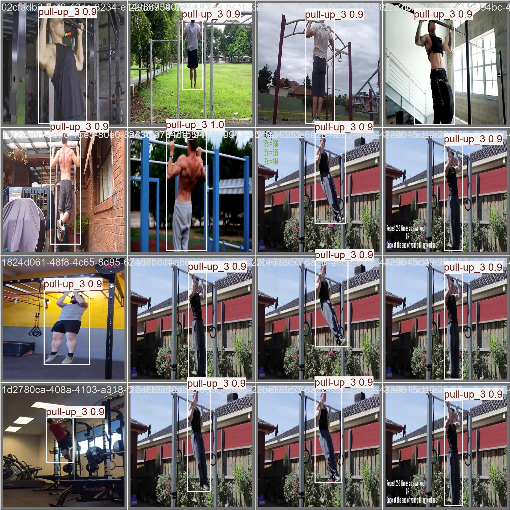
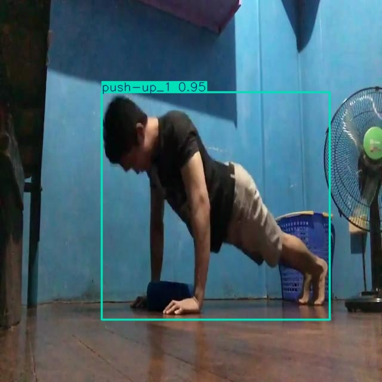

The project focuses on recognizing **sports exercises** from video using **YOLOv8**.  
Each exercise is divided into **three phases**: start, middle, and end, enabling fine-grained recognition of movements.  

###  Objectives  
- Build an AI model capable of detecting sports movements automatically.  
- Support both **fitness applications** and **rehabilitation systems**.  
- Provide phase-level recognition (start → middle → end) for better accuracy.  

###  Dataset  
- Source: **Kaggle Gym Workout Exercises Video Dataset**.  
- Annotation Tool: **Roboflow**.  
- Each exercise is labeled across 3 phases (e.g., `squat_1`, `squat_2`, `squat_3`).  
- Classes included: **Squat, Push-up, Pull-up, Hammer Curl, Russian Twist**.  

###  Methodology  
1. **Data Preparation** – Extract frames and annotate into 3 phases.  
2. **Model Training** – Three YOLOv8 models trained separately for start, middle, end frames.  
3. **Hyperparameter Tuning** – Batch sizes tested (8, 16, 32).  
4. **Evaluation** – Metrics include **mAP@50, mAP@50–95, Precision, Recall**.  

## Evaluation & Results  

We trained three YOLOv8 models to detect **sports movement phases** (start, middle, end).  
Each model was trained and evaluated on a labeled dataset of gym exercises.  

### Example Predictions  
- 

-  

###  Model Performance  
| Model          | mAP@50   | mAP@50-95 |
|----------------|----------|-----------|
| Start Frames   | 0.9947   | 0.8923    |
| Middle Frames  | 0.9949   | 0.8651    |
| End Frames     | 0.9814   | 0.8324    |

- **Start & Middle Frames** achieved the highest accuracy (mAP@50 ≈ 0.995).  
- **End Frames** had slightly lower performance due to dataset imbalance.  
- **Squat** and **Push-up** classes reached near-perfect detection.  
- **Russian Twist** and **Hammer Curl** performed lower because of limited samples and similarity between movements.  

###  Model Complexity  
- YOLOv8s (72 layers, ~3M parameters, 8.1 GFLOPs).  
- Efficient for real-time inference.  

###  Visual Results   

### 🔹 Visual Results  

-   
-   
-   

